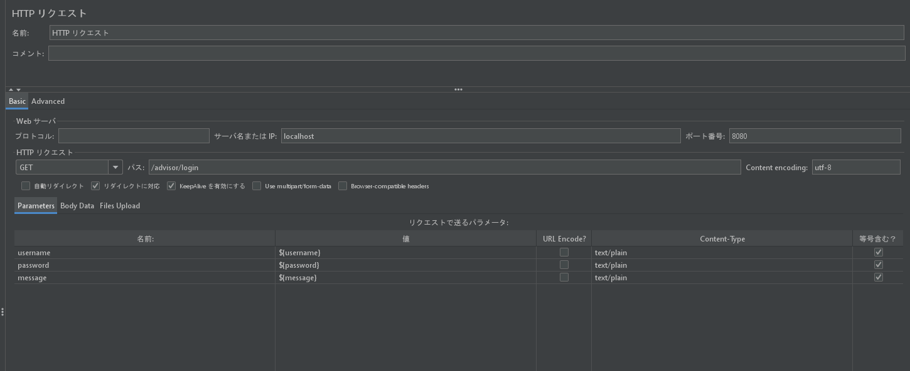
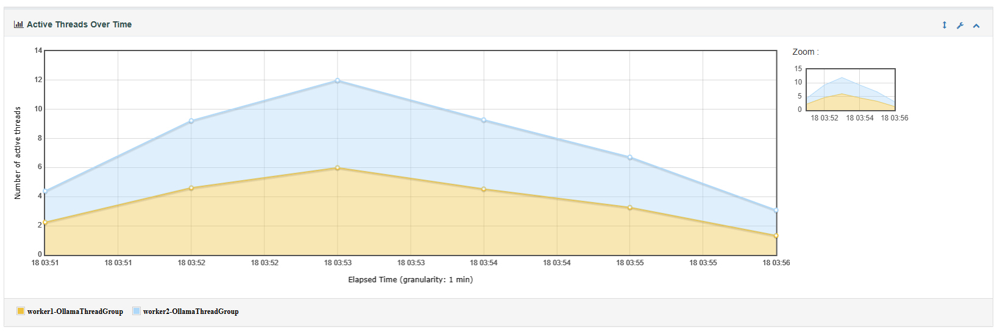
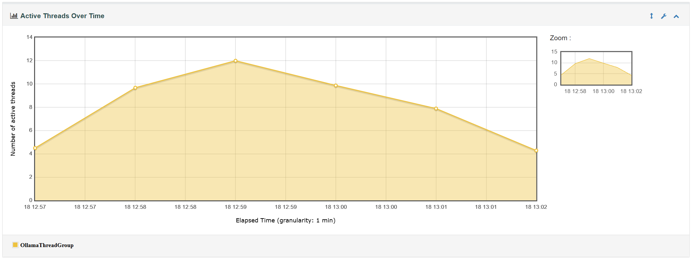
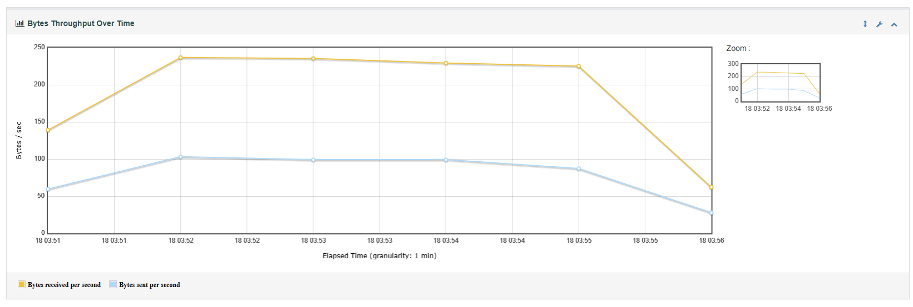
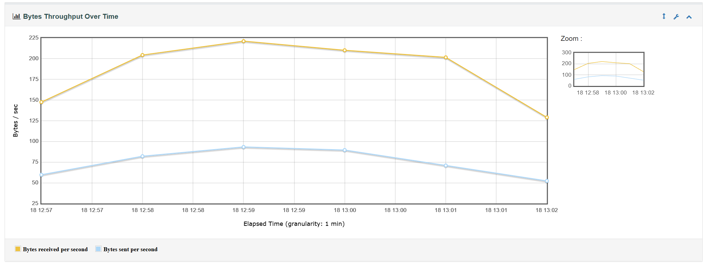
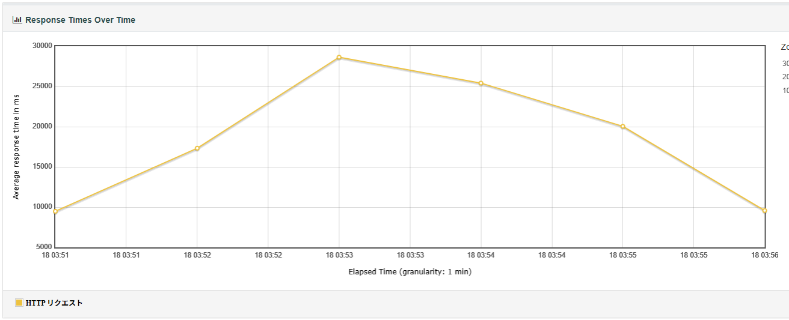
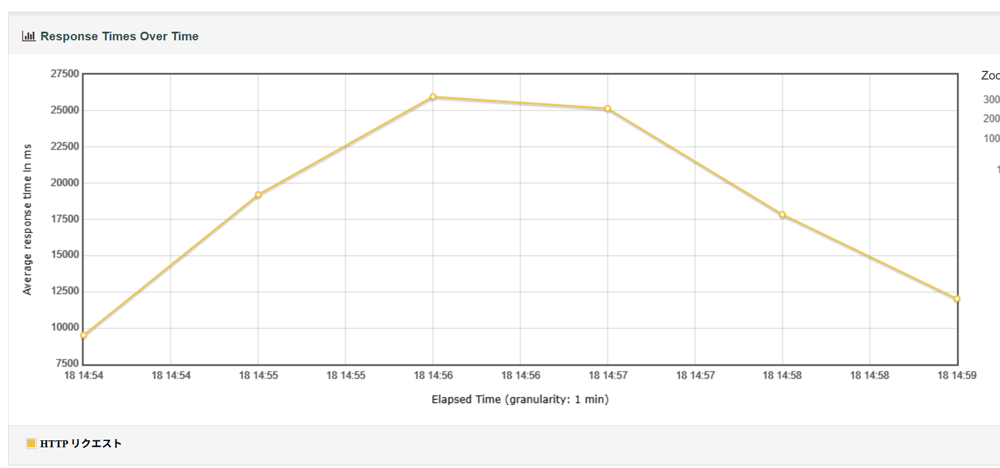
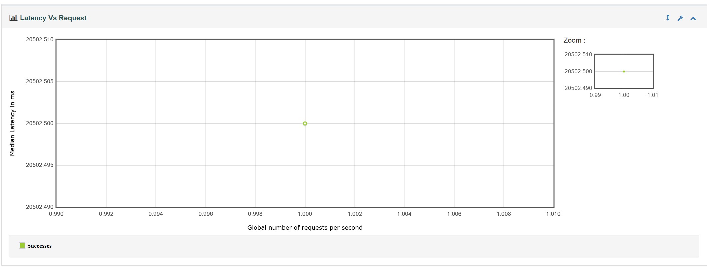
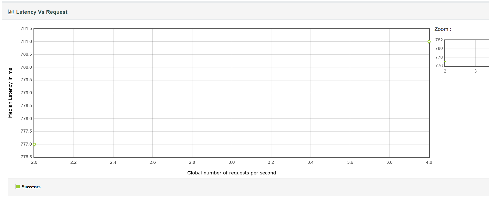

## Jmeter Core element :

テスト計画流れ：
テストプラン
スレッドグループ　→　 → 全体的に親ブランチ
簡単なコントローラ
Http Cookieマネージャー
ウェブページ１
ループコントローラ
ウェブページ２
ウェブデフォルト１
ウェブページ３
ウェブデフォルト

構成項目は使用するために、中から呼びます。例えば：上記のクッキーマネージャーを使ってできるのはウェブページ１とウェブページ２だけです（ウェブページ３とHttp Cookieマネージャーは同じ痩にありますので使えない）。
ツリー構造的にはウェブデフォルト１はウェブページ２しか使えないです。他では、ウェブデフォルトを使用します。

実行順番：
1. 構成項目
2. Httpリクエスト
3. プリープロセサル
4. タイマー
5. サンパラル
6. ポストプロセサル
7. アサーション
8. リスナー

スクリプト順番：
1. Httpリクエスト 
   1. JSR223サムパル
   2. プリープロセサル
   3. ポスープロセサル
   4. JSR223 Assertion　または　アサーション


## テスト構築方法

JMeterでは、

1. テスト計画：
　　</br>テスト計画はデフォルト的に・既に作成されています。ブランチ層的に１目です。
</br> これから色々な項目や機能をテスト計画の下に追加する。

2. スレッドグループ
　　</br>スレッドグループは一番大切な。
    スレッドの構成作成する。
    以下のようにスレッドプロパティがある。
    ->スレッドプロパティ
    ・スレッド名
    ・エラー後のアクション
    ・スレッド数（ユーザー）
    ・Ramp-up時間（秒）
    ・ループ回数
    ・スケジューラ

3. HTTP リクエスト
　　スレッドグループの下にHttpリクエスト追加、
　　Httpで公開されたアプリとか性能テスト可能。
　　
　　※今まで設定したら実行できる（簡単な設定）。

4. プロセサル
　　主に２種類のプロセサルがある：
    * 前処理 
    * 後処理
    ※


### コマンド一覧：
#### 基本コマンド：
```java
jmeter -n -t "path/to/test.jmx" -l "path/to/results.jtl"
```
#### ダッシュボードレポート生成含めてコマンド：
```java
jmeter -n -t "test.jmx" -l "results.jtl" -e -o "path/to/report_folder"
```
#### デフォルトプロポティの上書き
```java
jmeter -n -t "test.jmx" -l "results.jtl" -Jthreads=50 -Jduration=300
```

* -n : CLI モード
* -t : テスト計画へのパス
* -l : ローグファイルへのパス
* -e : レポートを生成
* -o : レポートフォルダへのパス
* -x : テスト終了したら停止


※JSR223 sampler と Http　リクエスト同時に設定された場合、結果（スーリー結果と詳細結果）も二つの計算するので気を付けて。
例えば：二つ件（ロギング可、ロギング不可）のスレッドグループに２スレッドした場合、
2回Httpリクエストと2回JSR223sampler → 
JSR223Sampler → script チェックする（未処理）
Httpリクエスト　→　リクエスト確認する　

```log
timeStamp,elapsed,label,responseCode,responseMessage,threadName,dataType,success,failureMessage,bytes,sentBytes,grpThreads,allThreads,URL,Latency,IdleTime,Connect
1773638597623,114,HTTP リクエスト,500,,OllamaThreadGroup 1-2,text,false,,5362,172,2,2,http://localhost:8080/advisor/login?username=Gol.D&password=some123&message=hi,111,0,58
1773638597878,68,JSR223 Sampler,200,OK,OllamaThreadGroup 1-2,text,true,,0,0,2,2,null,0,0,0
1773638597623,9215,HTTP リクエスト,200,,OllamaThreadGroup 1-1,text,true,,289,172,1,1,http://localhost:8080/advisor/login?username=sudh&password=password&message=hi,9214,0,58
1773638606844,2,JSR223 Sampler,200,OK,OllamaThreadGroup 1-1,text,true,,0,0,1,1,null,0,0,0
```


### Master/Slave ・ Controller/Worker:

JMeterエンジンを実行している
脳→指示を送信する。


Worker/Slave:
Worker	はControllerの指示を待っている。
既に実行中（jmeter-server.sh）→コントローラの指示を待っている。
DockerでController/Workerを作成する手順：
Dockerイメージを作成・プル（justb4/jmeter:latest）
コントローラとWorkerを連絡するためにDockerネットワーク作成するコマンド：
docker network create jmeter-net
削除したい場合：docker network rm  jmeter-net
Workerコンテナー作成や実行コマンド
```java
docker run -d --name worker1 --network jmeter-net justb4/jmeter -s -Jserver.rmi.ssl.disable=true
```
```java
複数Worker作成したい場合、
CMD：docker run --rm --network jmeter-net -v %cd%:/test justb4/jmeter -n -t /test/study_test.jmx -l /test/results.jtl -R worker1,worker2 -Jserver.rmi.ssl.disable=true
```
```java
上記にコマンドの説明：
docker run --rm --network jmeter-net -v %cd%:/test justb4/jmeter -n -t /test/study_test.jmx -l /test/results.jtl -R worker1,worker2 -Jserver.rmi.ssl.disable=true -e -o /test/output
```


```java
docker run --rm --network jmeter-net -v %cd%:/test justb4/jmeter	
```
#### justb4/jmeter まではDockerのコマンドです。その後はJMeterのコマンドです。
  docker run --rm --network jmeter-net 
* --rm :: 実行後削除
* --network jmeter-net :: 同じネットワークに接続
* -v %cd%:/test justb4/jmeter :: %cd%==今のパス(実行しているところのファイルパス)は/testをとして設定します。（Docker側と連絡するため、結果やログを確認するために自分の端末のファイルパスに保存する方法）

```bash
 justb4/jmeter -n -t /test/study_test.jmx -l /test/results.jtl -R worker1,worker2 -Jserver.rmi.ssl.disable=true -e -o /test/output
-n:　未画面・未GUI
-t: 　テストプラン
-l: 　テストログ
-R:  Workerを呼ぶ
-e: Htmlレポート作成フラグ
-o: 出力レポートパスフラグ
```
```YAML
※Dockerに関する、他必要なコマンド：
*docker ps -> コンテナー表示
*docker rm コンテナー名： コンテナー削除したい場合
*docker network create jmeter-net: Dockerでネットワーク作成
*docker network rm jmeter-net: ネットワーク削除したい場合
```
※ローカル端末ではFirewall・Window defenderがインストールされた場合、Controller/Workerは構築できません。まあ、ほぼほぼWorker・Controllerに分かれて使ってときはいつもはAWSや他の環境にあり

## マスタースレーブ系　Vs 単ワーカ系テスト
Master/Slave テスト系はDockerで公開して実装。
一般スレッドテスト系は普通のロカール端末で実装。

### データ分析

テスト状況１：エラー件なし

* ramp時間：120秒
* ループ回数：10

* スレッド：
マスタースレーブ系
Worker1：6
Worker2：6
単ワーカ系
スレッド回数：12


ActiveThreadOverTime

マスタースレーブ系：
以下の画像の通り６スレッドはそれぞれWorker１、Worker２が使っています。
※以下の画像見たら混乱する可能性もあります。画像の青色のピクは12スレッドですがそれはワーカ1とワーカ2にの６スレッドと６スレッドです（6+6）。ワーカ１の上にワーカ２を被った線グラフです。


単ワーカ系：
以下の画像では12:59で12スレッドがアクティブになりました。


BytesThroughputOverTime

マスタースレーブ系：

Bytes送信：
マスタースレーブ系でBytes Throughput over time は03:52から03:55までは一番高かった。そこでも一番値は237です。
単ワーカ系でBytes Throughput over time は12:58から13:01は一番高かったです。
そこでも一番値は221です。
比較したらマスタースレーブ系は最も

Bytes受信：




ResponseTime:

マスタースレーブ系：
Average response time は
11:51:09.395~11:56:09.485＝05分 
11:53→ピクロード　
response times over time → 28637ms


単ワーカ系：
14:54:11.747~14:59:04.565＝05分
14:56→ピクロード　
response times over time →　25983ms


レスポンス時間を見るとマスタースレーブ系のより単ワーカ系の方はレスポンス早いでした（28637ms-25983ms=2654ms/2.6秒）。この条件の理由はDockerで動いても端末は同じリソース（メモリーやプロセサル）を使っていますので、複数ワーカを作成してももっと時間かかってしまいましたそうです。ですが、普段はマスタースレーブ系をAWSやサーバ側で動くものですからパフォーマンスをよく旨くなりそうです。

※少ない処理時間の場合
#### 受信Bytes
マスタースレーブ系　→　238
一般スレッド　→　224
結果を見ると（ 238-224= 14Bytes ）, Master/Slave系はもっと14Bytesを加えていたそうです。それの理由はMasterとWorkerを連携するため、RMI（Remote Method Invocation）プロトコルを使っていますのでRMIを使いためにかかった14Bytesでした。

### Bytes throughput over time 
単ワーカ系 -> 10:15 :: 9
         10:16 :: 106
マスタースレーブ系　-> 104

Peak Bytes throughput over time　はローカルでは106Bytes/sec でしたが Master/Slave では104Bytes/secでした。Master/slave側は遅いと見えていますがこの状況の理由はMaster側でWorker側の連携するための時間かかったのでです。後は本テストでは処理時間はWorker１とWorker２に分かれていましたので一般でWorker側からMaster側への結果送信した時、Master側で結果は収取した時は一般のデータと思った可能性が多いです。後は連絡取る時のネットワーク遅延とWorker側は指示もらって初期化される時間もあります。

#### Latency
Latencyはとても遅かったです（20435ms/20.4秒）。

なんでこんな遅かった理由を探して見ました。以下は私の認識です。
Javaアプリで公開したAPIので色々処理が入っていますので、時間がかかりました。


直接にOllamaAPIを連絡したらLatencyがよくなりました。(777ms/2requestpersecond=388.5ms/0.388秒)

詳細結果：apache-jmeter-5.6.3\apache-jmeter-5.6.3\結果\DirectOllama
実行コマンド：
```sh
 ./jmeter.bat -n -t ./TestPlanTemplate/DOLatency.jmx -l ./results.jtl -e -o ./output
```


