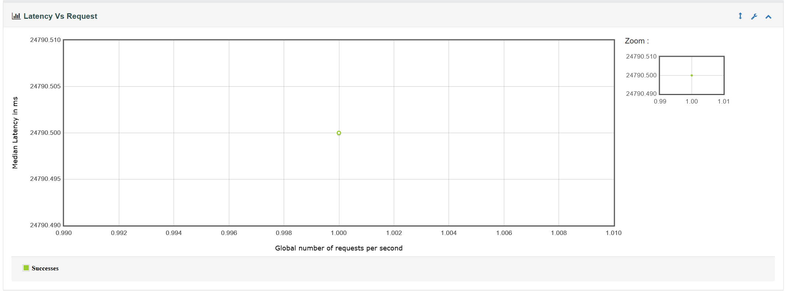
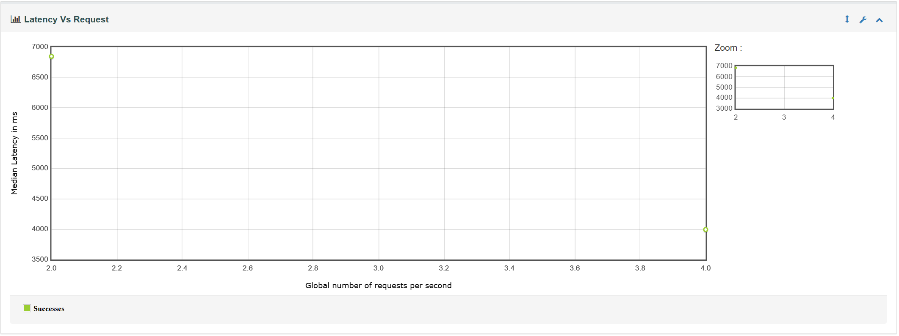
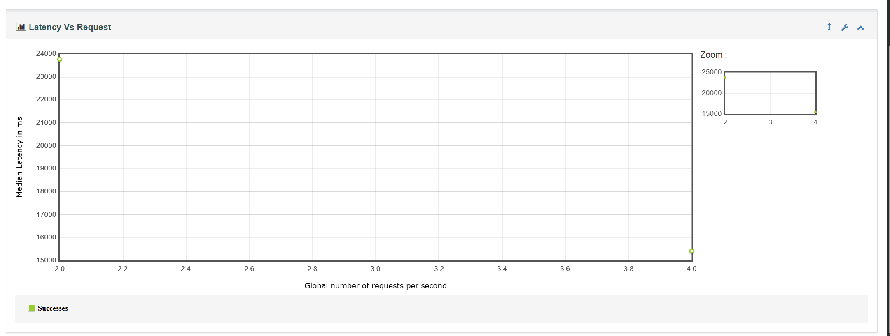

##　Latency Vs Request

[単ワーカ系](./結果/12件120秒RAMP/単ワーカ系/output/index.html)
#### 状況：
1 req/sec の負荷をかけた際、レイテンシのメディアンは 24,790.500ms でした。とても多いです。



[gwen＿単ワーカ系](./結果/12件120秒RAMP/gwen＿単ワーカ系/output/index.html)
[Ollama＿gwenログ](./ollama_gwen.log)
#### 状況：
2 req/sec の負荷をかけた際、レイテンシのメディアンは 6,848ms と
4 req/sec の負荷をかけた際、レイテンシのメディアンは 3,994ms となりました。



[gemma＿単ワーカ系](./結果/12件120秒RAMP/gemma＿単ワーカ系/output/index.html)

[Ollama＿gemmaログ](./ollama_gemma.log)
#### 状況：
2 req/sec の負荷をかけた際、レイテンシのメディアンは 23,773ms と
4 req/sec の負荷をかけた際、レイテンシのメディアンは 15,411ms となりました。


【パフォーマンステスト最終結果まとめ】
今回、異なる環境とモデルに対してJMeterで負荷テスト（Master/Slave構成）を実施し、以下のレイテンシ（Time to First Byteの中央値）を計測しました。

1. 改善前（Spring Boot API経由 / 同期処理によるバッファリング）

1 req/sec: 24,790.5 ms

考察: Java側でOllamaの全生成完了を待機しているため、約25秒の深刻な遅延が発生している。

2. Ollama API 直接アクセス（Gemma モデル）

2 req/sec: 23,773 ms

4 req/sec: 15,411 ms

考察: モデルサイズが比較的大きいため、GTX 1650（Tensor Coreなし）では計算負荷が高く、依然として15秒〜23秒のレイテンシが発生する。

3. Ollama API 直接アクセス（Qwen 軽量モデル）

2 req/sec: 6,848 ms

4 req/sec: 3,994 ms

考察: 軽量モデルへの変更によりGPU VRAMに完全に収まり、大幅な高速化（Gemma比で約4分の1）に成功した。

【重要な発見：GPUのバッチ処理効果】
Gemma、Qwenともに、負荷を 2 req/sec から 4 req/sec に上げた際に、逆にレイテンシが改善（短縮）するという興味深い結果が得られた。これは、Ollama内部の推論エンジン（llama.cpp）が、同時に到着したリクエストを「バッチ」としてまとめ、GPU上で一度に並列計算する最適化（Batch Processing）が強力に働いたためである。

上記では、 1req/sec の負荷をかけた際、レイテンシのメディアンは 24,790.500ms でしたが以下の修正したから2 req/sec: 6,848 msと4 req/sec: 3,994 msようにレイテンシのメディアンを減らすことを出来ました。
* コード修正：
以下の通りコードをストリムデータ型を返却するようにしました。

変更前：
```java
ollamaOfficeChatClient.prompt(message).call().content();
```

変更後：
```java
ollamaOfficeChatClient.prompt(message).stream().content();
```
* ollama複数並列処理：
複数並列処理（OLLAMA_NUM_PARALLEL=2）が設定しました（最初は１でした）。

* GemmaモデルからQwenに移動しました（もっと軽いモデル）。


